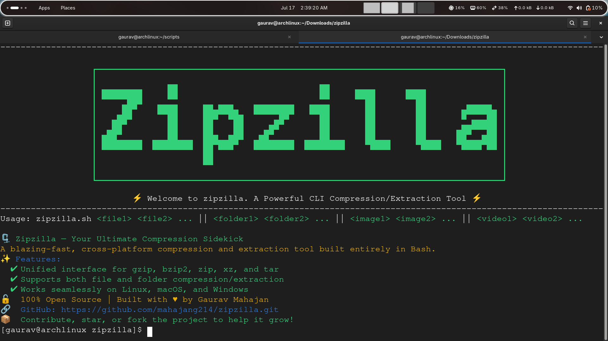
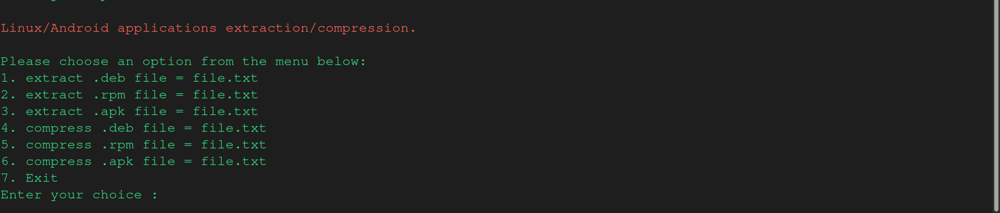
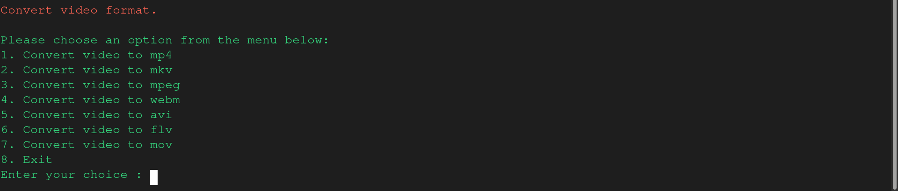

# 🗜️ Zipzilla


A blazing-fast, cross-platform compression and extraction tool built entirely in Bash. Zipzilla provides a unified interface for managing various file formats with an intuitive CLI experience.

### 📷 Screenshot







## ✨ Features

- **Universal File Handling**

  - Compress and extract files, folders, images, and videos
  - Support for multiple archive formats (zip, tar, gzip, bzip2, xz)
  - Automated package manager detection and dependency installation
  - Cross-platform support (Linux, macOS, Windows via WSL)

- **Video Processing Capabilities**

  - Convert between popular video formats (mp4, mkv, mpeg, webm, avi, flv, mov)
  - Extract audio from video files
  - Create video clips with custom duration
  - Adjustable compression quality settings

- **Application Package Support**
  - Handle `.deb` packages (Debian/Ubuntu)
  - Process `.rpm` packages (RedHat/Fedora)
  - Work with `.apk` files (Android applications)

## 🚀 Quick Start

1. Clone the repository:

```bash
git clone https://github.com/mahajang214/zipzilla.git
cd zipzilla
```

2. Make the script executable:

```bash
chmod +x zipzilla
```

3. Run Zipzilla:

```bash
./zipzilla file1 file2 ...
```

## 📖 Usage

### Basic Commands

```bash
# Compress files
./zipzilla file1.txt file2.txt

# Compress folders
./zipzilla folder1 folder2

# Process video files
./zipzilla video.mp4

# Extract archives
./zipzilla archive.zip
```

### Menu Options

1. **Files extraction/compression**

   - Support for gzip, bzip2, zip formats
   - Automatic compression/extraction detection

2. **Folders extraction/compression**

   - ZIP archive creation
   - TAR + GZIP/BZIP2/XZ compression
   - Various extraction options

3. **Images extraction/compression**

   - Supports jpg, jpeg, png, and webp
   - Multiple compression methods

4. **Videos extraction/compression**

   - Supports mp4, mkv, mpeg formats
   - Audio extraction
   - Clip creation
   - Custom quality compression

5. **Linux/Android applications**

   - DEB package handling
   - RPM package processing
   - APK file management

6. **Video format conversion**
   - Convert between multiple formats
   - Quality preservation options

## 🛠️ Dependencies

Zipzilla automatically handles dependencies through your system's package manager:

- `zip/unzip` - For ZIP operations
- `tar` - For TAR operations
- `gzip` - For GZIP compression
- `bzip2` - For BZIP2 compression
- `xz` - For XZ compression
- `ffmpeg` - For video processing
- Various package-specific tools (dpkg, rpm, apktool)

## 🎨 Color Coding

The interface uses color coding for better visibility:

- 🟢 Green: Success messages
- 🔴 Red: Error messages and warnings
- 🟡 Yellow: Important notes and prompts

## 🤝 Contributing

1. Fork the repository
2. Create your feature branch (`git checkout -b feature/amazing-feature`)
3. Commit your changes (`git commit -m 'Add amazing feature'`)
4. Push to the branch (`git push origin feature/amazing-feature`)
5. Open a Pull Request

## 📝 License

This project is licensed under the MIT License - see the [LICENSE](LICENSE) file for details.

## 👥 Authors

- [@mahajang214](https://github.com/mahajang214) - Initial work and maintenance

## 🙏 Acknowledgments

- Thanks to all the open-source tools that make this project possible
- Community contributors and testers

## 🐛 Bug Reports

If you find any bugs or have feature requests, please create an issue in the [GitHub repository](https://github.com/mahajang214/zipzilla/issues).

---

<p align="center">Built with ❤️ by Gaurav Mahajan</p>
